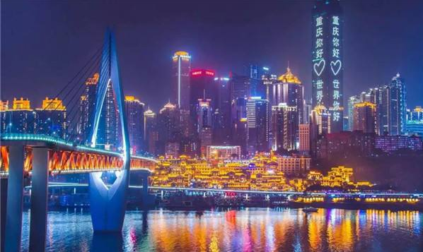
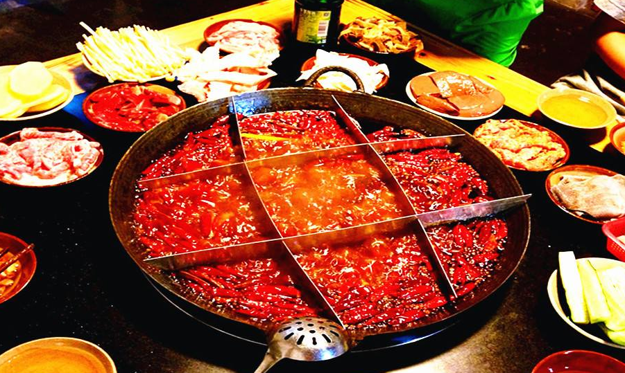
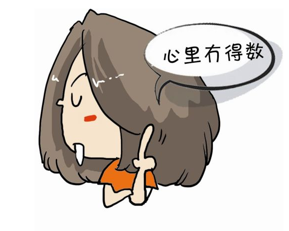

15号上午开完会，从重庆赶回了家，从母校到汽车站的路上，看到熟悉的街景，一切历历在目：

似乎想起了当年自己还是小女孩，母亲和姐姐第一次送我来重庆报到时的场景，想起了第一次来到南山之巅，被山路惊讶到的场景，想起了以前连下山去逛一趟南坪、解放碑时都是一种勇气时的场景，想起了穿梭在沙坪坝和南岸之间公交车的场景，想起了毕业前几乎每天穿梭于上新街和学校并且晚上老师开车捎我回家的场景。。。

时间确实过得真快，没有想完，也想不完，就到车站了，那些美好的场景，就让他默默地珍藏于心吧！

下午2点左右的汽车，到老家市区已是晚上了，姐本说来接我，结果汐汐（侄女儿）小朋友吵着说要一起来，没办法，姐来不了，带着小朋友没法开车。自己依然拖着沉重的箱子回了家。虽然开心、激动，但是有点感冒疲惫的我，在拖过沉重箱子后，手臂真的好酸好痛。

