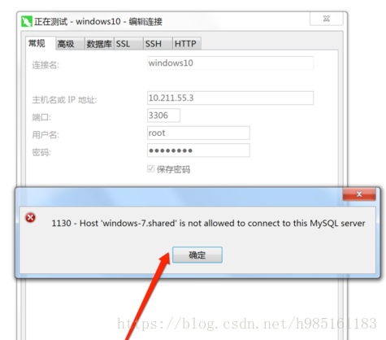
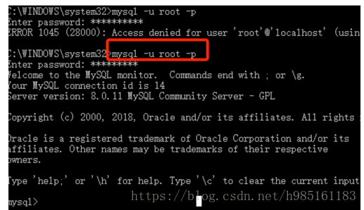
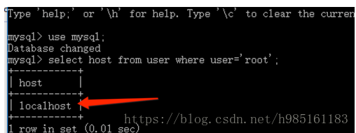
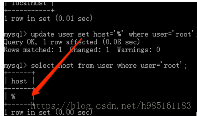
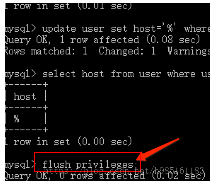

## 错误出处： 
mysql从远程连接本地，即时代码正确也连接不上，是由于本地mysql配置不正确的原因 

## 解决办法： 
1.在用Navicat配置远程连接Mysql数据库时遇到如下报错信息，这是由于Mysql配置了不支持远程连接引起的。 

2.在安装Mysql数据库的主机上登录root用户： 
mysql -u root -p 

3.依次执行如下命令： 
use mysql; 
select host from user where user='root'; 
可以看到当前主机配置信息为localhost. 

4.执行update user set host = '%' where user ='root'将Host设置为通配符%。 
Host设置了“%”后便可以允许远程访问。 

5.Host修改完成后记得执行flush privileges使配置立即生效。 

6.使用navicat 成功连接至mysql 

版权声明：本文为CSDN博主「B-W」的原创文章。 
原文链接：https://blog.csdn.net/h985161183/article/details/82218710 
