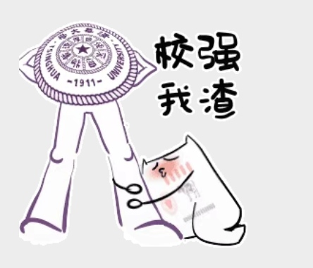

# 三件事 
## 1、母亲对我结婚的态度 
以前真的好担心，以为妈咪听到我说结婚的事情，会对我说：“还在读书，结什么婚。”，从和母亲聊到哥哥明天生日，到生肖属相。母亲说哥哥属羊，吃草的，我是属鸡，捣乱的，哈哈，好像有点这么回事。无意提了一下叫母亲去帮算个八字，母亲说：“怎么了？要结婚了。。。嗯，好像也该结了，年纪也不小了。你要结我也不拦你，你不结，我也不会赶你出去”  
oh my god，难道想赶我出去吗，现在我就这么不受重视了吗？有点心塞呢。给哥哥说了以后，他自个儿在旁边开心得不行。 
## 2、哥哥明天生日 
明天晚上还要排练一.二九大合唱表演，回不去陪哥哥过28岁生日，虽然去年生日错把蜡烛买成了28，但今年必须得过呀，我还得买蛋糕呢，自己好想吃，啦啦啦。 
## 3、本周有点忙 
下周的pre和节课报告，这周没有什么空余时间，争分夺秒，博士的周末是最兴奋的。因为，没有人可以打扰我，我可以专心搞研究。科研使我兴奋，耶！

