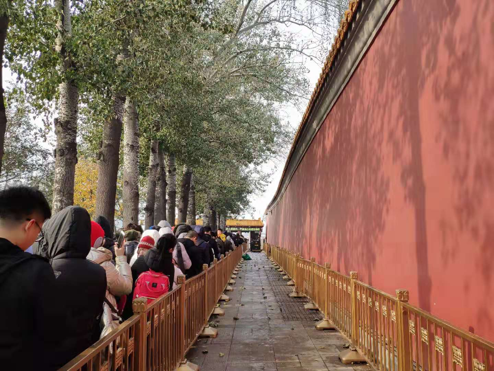
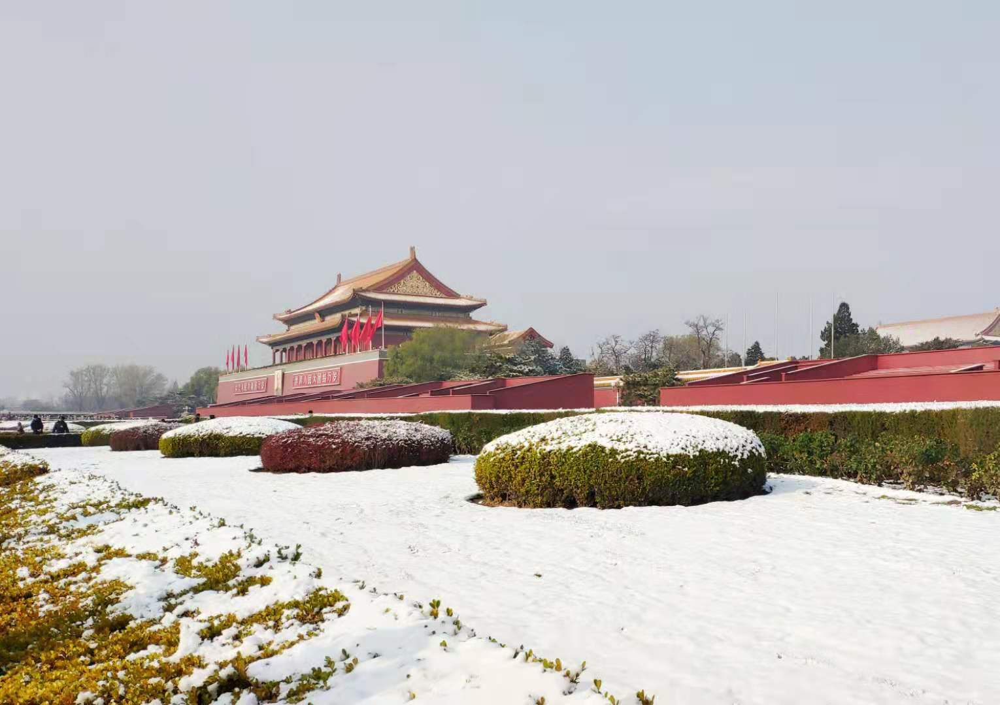
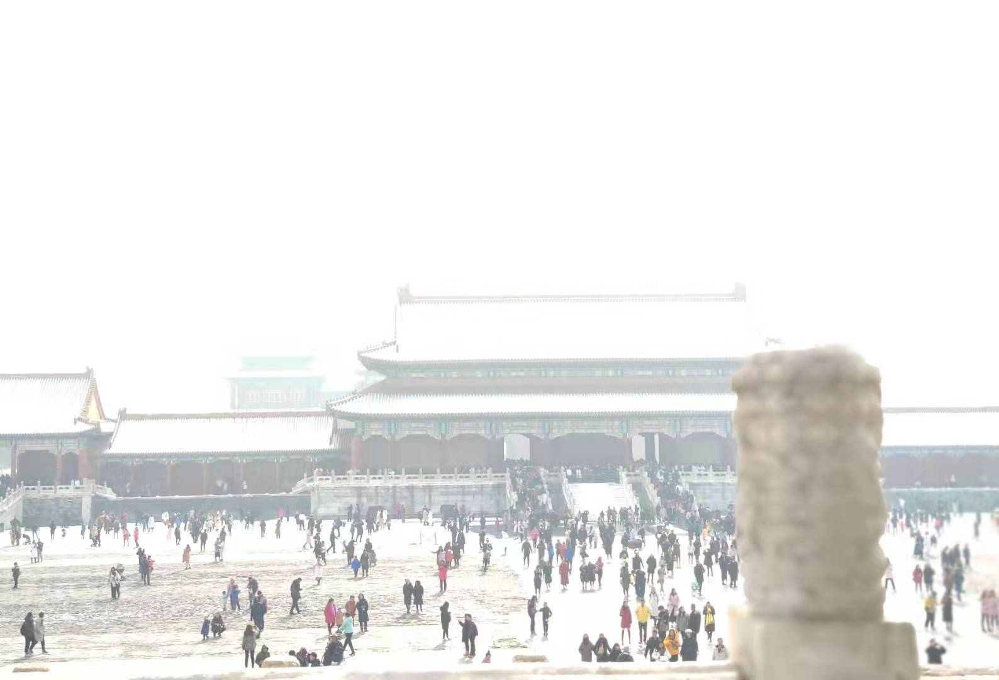
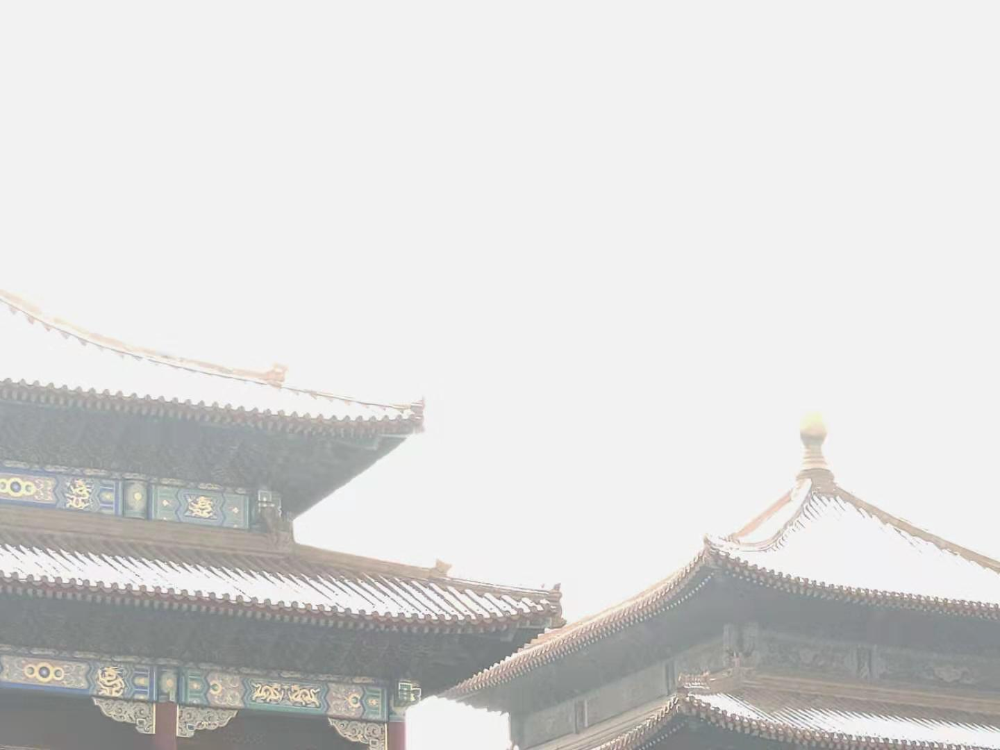

## 北京初雪 
前两天就看到天气预报说北京下雪，之前还不以为意，以为这雪下不下来，结果没想到下下来了，并且还积了不少。今天鼓起勇气，抽出时间去了故宫看雪，想看看自己梦寐以求的紫禁城内雪的模样（受延禧攻略影响），不过，真的很好看。要是雪没有停就更棒了。 
这次没有去看各个殿，主要是欣赏外面宫墙内的红砖与白雪之间的古典美。 
因为去的比较晚，排队进故宫也花了接近一个小时时间，人真的超多，去的时候，有些地方的雪都开始化啦。随便放几张图吧，一起来欣赏一下。 
#### 从地铁天安门东出站，排队安检进天安门 

#### 天安门

#### 故宫内 

哈哈，美吧，远远看见景山公园上面已经站不下人了，就没有上去，上面可以看故宫全景。下次下雪可以换个地方看看了。开心。 
最后，祝哥哥阳历生日快乐，差点忘了，嘻嘻。
