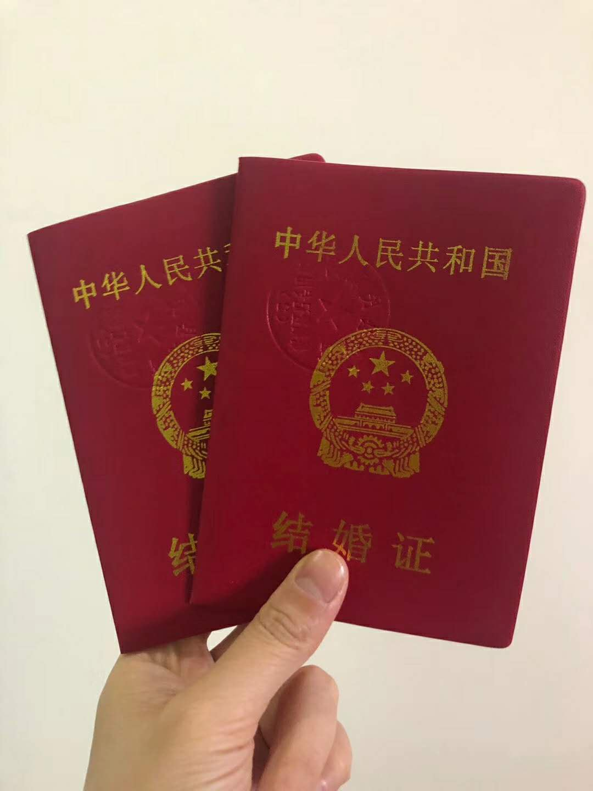

疫情原因，领证真是个紧张的事情。

一大早，姐姐姐夫就开车送我们去民政局，

一路上，怀着紧张、激动、开心、忐忑的心情，

我这是要嫁人了吗？

有些觉得不真实，

但又确实发生着。

民政局外，进去需要量体温，

领证的地方，人不多，大家都戴着口罩，

经过多次签字、确认，

咱俩正式成为wife and husband，

拍完照，去体检，

体检在二楼，人稍多，因为有很多产检的，

大家都戴着口罩，

经过一个多小时的各个科室穿梭，

终于搞定了体检。

怀着紧张、激动的心情，离开了民政局。

哈哈，我真的成为人妻了吗？

看看袋子里面的结婚证和拍的相片，心里再次确认，是的！

先去了姐姐家，准备弄几张图片，发给朋友圈，

说实话，有些饿了，

姐姐从家里面找到了点香肠、红酒（真是只有这两样），

突然发现：（肠酒）长长久久，这个寓意好，瞬间幸福升华了。

嘻嘻，（戏）囍有点多，请见谅！

