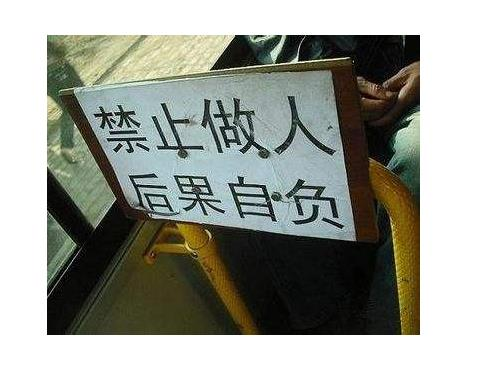

疫情还没结束，但安装宽带的小哥还是来了，估计想挣钱了吧。

看着小哥年龄不大，估计22左右，看动作麻利迅速，一顿操作猛如虎，把一大捆捆线，经过爬山涉水翻电杆，终于迁好了。然而……线没有通，来来回回搞了一下午，没找出原因。嗯，估计是线在拉的时候扯坏了吧。明天再来吧，还有这么多人打电话来，先去其他家。

第二天，小哥又拿一捆线来………………终于，重复了上面的步骤，额，好像还是不通，怎么肥四？再想想

第三天，小哥又来了，又带了捆线，真是不抛弃不放弃，这种精神值得钦佩。这次似乎发现好像是工具有问题，然后给领导打电话，领导过了一会儿来了，两个人在基站那边倒腾了好久，都快到晚上了，好像还没吃午饭，我们都有点不好意思了，这200块钱真是不好挣啊。哦，不对，这钱是直接从电话卡里面扣，他们还拿不到钱，想想都有点心塞呢。终于，这次在有他领导的协作下，宽带终于搞定了。他领导说，他刚做没几天，没多少经验。本来说自己设置路由器的，看小哥这么辛苦的份上，就叫他们帮忙设置路由器吧（本来要收50块钱的），领导说就30吧，正好还抵消前两天上街买工具借的钱，另外的3块钱网线费小哥还帮忙垫着。

一顿感谢后，他们离开了。哈哈，真是一次有趣的经历。

