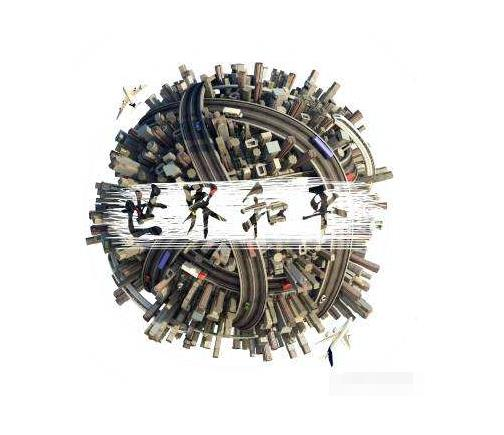

时间过得挺快，在家待了快2个月了，真是没想到。但是疫情也有所好转，现在湖北一天也只有几十个新增确诊了，可能过两周就应该好的差不多了。不过，国外目前还处于大爆发阶段，韩国、伊朗、意大利。。。希望控制好。不然，还得在家待，不是不想在家，主要是在家的学习效率实在很低。
  
而且，咱两自从领证后，第二天哥哥就去北京上班了。
  
然后开启了异地恋（不对，异地婚姻）模式。甚是想念，也希望能早点去北京和哥哥相见。
  
今天，也是去年哥哥给我求婚的日子。挺值得怀念的。有点不开心，哥哥没有主动给我发消息纪念周年日（不能原谅）。还好在几番暗示下，他还是想起了，勉强接受吧，下不为例。
  
  
这两天特殊情况，加上头疼，昨晚一晚上没睡着，今天也没休息，侄儿过生，家里面气氛太嗨，早点休息。愿世界美好！
  